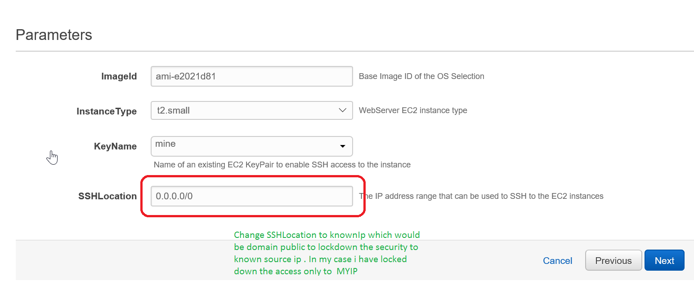

# sinatraApp

## Initial learning

	I would like to admit, I have never worked on ruby on rails application before, 
	but test gave me opportunity to learn before I start working on the solution to understand 
	how rails application works.

## Approach

		The approach I selected to use AWS for deploying the application for simplicity, repeatable deployments 
	for the infrastructure as code and deploy the application quickly. I have used the AWS Cloud formation template 
	for infrastructure/configuration as a code for creating the VM , configuring security and open the required
	ports for the application to access. Shell script also written as code to deploy the application and required 
	ruby and bundler packages to be installed as a unit ,application will be running automatically after successful completion of the 
	cloudformaiton stack creation.

## How to execute the cloudformation template:

	* Login to AWS Account 
	* As prerequisite create the keypair for us to use to login using the keypair to instance created 
	* Choose Cloudformation Service 
	* Select Create Stack Upload the "EC2Instance-SinatraApp.json" file to S3 
	* Enter StackName 
	* By default template configured to use the ubuntu base image for creating VM and also chooses default VPC and subnet settings for deploygin this image. 
	* Choose "keypair" created initially as prereq from the dropdown, ## as the template list available keypairs 
	* SSHLocation configured to allow the 22/80 to be accessable from anywhere . ##The application will be running on 80 port.
 
	
	* Click Next ,##for this we we dont need to configure much of the tags or IAM profiles to access other resources.
	* Click Create
	
## Expected output

	* On the output section of the template completion-PublicIp and DNS Names will be available accessing the application.
 	* How to Access the application from browser http://<PublicIP>/  or from command Line curl -svL http://<PublicIP>/
